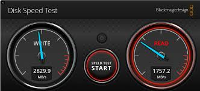

# Storage Speed Test

A Python terminal-based application for measuring the read and write speed of USB storage devices, SSDs, and hard drives. This project allows users to select their storage device and test its performance while providing detailed information about the device, such as file system type and size. The application supports Linux, Windows, and macOS.



---

## Features

- Dynamically detects storage devices across **Linux**, **Windows**, and **macOS**.
- Displays detailed information about each device (size, file system type, etc.).
- Allows users to select the file size for the speed test.
- Shows **progress bars** during read/write tests using `tqdm`.
- Logs detailed information about test results and errors to log files.
- Supports terminal-based GUI using `npyscreen`.

---

## Requirements

- Python 3.x
- Required Python libraries:
  - `tqdm` for progress bars
  - `psutil` for device detection (Windows)
  - `npyscreen` for terminal GUI

### Installation

To install the required libraries, run:

```bash
pip install tqdm psutil npyscreen
```
## How to Run
1. Clone the Repository
```bash
git clone https://github.com/yourusername/storage-speed-test.git
cd storage-speed-test
```
2. Run the Application
To start the application, simply run the Python script:

```bash
python3 storage_speed_test.py
```
3. Select a Device
    - Once the program starts:
    - You will be presented with a list of available storage devices.
    - Select the device you want to test from the list.

4. Choose File Size
Enter the file size (in MB) to use for the speed test (default is 500 MB). The larger the file size, the more accurate the test will be.

5. Run the Speed Test
The program will measure the write and read speeds of the selected device, displaying results in real-time.

6. View Results
Once the test is complete, you'll see the write and read speeds in MB/s displayed on the terminal.

## Logs
- Info Logs: Stored in ```./logs/info.log```
- Error Logs: Stored in ```./logs/error.log```
Logs will contain details about the test results, errors, and more for future reference.

Contributing
Contributions are welcome! To contribute:

## Fork the repository.
1. Create a new branch (```git checkout -b feature/new-feature```).
2. Make your changes and commit them (```git commit -m 'Add new feature'```).
3. Push to the branch (```git push origin feature/new-feature```).
4. Open a Pull Request.